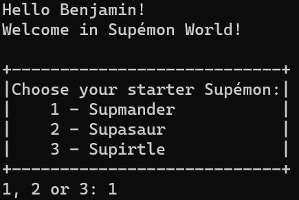
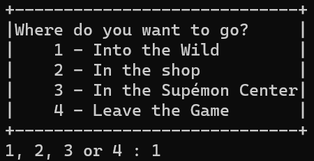
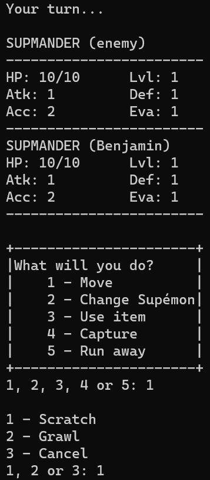

# 1-CDEV Supemon

**Table of contents:**

1. [Instructions](#instructions)
   1. [Introduction](#1---introduction)
   2. [Implementations](#2---implementations)
   3. [Delivery](#3---delivery)
   4. [Grading Scale](#4---grading-scale)

2. [How to compile and execute the project](#how-to-compile-and-execute-the-project)
   1. [On Windows](#on-windows)
   2. [On Linux](#on-linux)

3. [Documentation](#documentation)
   1. [main.c](#mainc)
   2. [structures.c and structures.h](#structuresc-and-structuresh)
   3. [display.c and display.h](#displayc-and-displayh)
   4. [features.c and features.h](#featuresc-and-featuresh)

## Instructions


## 1 - Introduction

SUPINFO World CLI Gaming asks you to develop a CLI (console) version of Pokemon in C called ***Supemon***.

It has to be realised by groups of a maximum 2 students in 3 weeks and is mostly based on what you have seen during this course, but some parts may need a little research to complete. **One and only one** group of 3 is allowed **if and only if** the class has an odd number of students, and all other groups have 2 members.

You are not allowed to copy or adapt an existing code or share information with other groups.

**Failure to comply with the above instructions or the delivery rules will result in a grade of 0.**

If you do not know, first, shame on you, and then check out this [link](https://en.wikipedia.org/wiki/Pok%C3%A9mon_Red,_Blue,_and_Yellow).

## 2 - Implementations

### 2.1 - Program launch

You must allow the player to enter a name and offer them a Supemon.

Otherwise, the player must be able to load a backup file.



### 2.2 - Out-of-combat actions

* **Into the Wild:** Launch a fight against a random Supemon.
* **Shop:** allows the player to buy or sell items.
  * In buying mode, display all items listed with their description and price. Allows you to buy a specific item.
  * In selling mode, display all player's items with their selling price. Allows to sell a specific item.
* **Supemon Center:** displays all players' Supemons and asks to heal them (without charge).
* **Leave the game:** with or without saving progress.



### 2.3 - Player

The player has:

* A name.
* A list of Supemon.
* A selected Supemon (fighting).
* Supcoins to buy items.
* A list of items.

### 2.4 - Supemon

The Supemon have:

* A name.

* Level (starting from 1).

* Experience (starting from 0).

* HP and Max HP (current [not reset between fights] and maximum health points).

* Attack and Base Attack (current and base [start of the fight] Attack): the higher the Attack, the more damage Supemon does per offensive move.

* Defence and Base Defence (current and base [start of the fight] Defence): the higher the Defence, the less damage Supemon takes per offensive move.

* Evasion and Base Evasion (current and base [start of the fight] Evasion): the higher the Evasion, the more Supemon can dodge an offensive move.

* Accuracy and Base Accuracy (current and base [start of the fight] Accuracy): the higher the Accuracy, the less Supemon can miss an offensive move.

* Speed: used to determine the playing order.

* A list of moves.

You will implement (at least) these 3 Supemons (here are displayed level 1 statistics):

* **Supmander:**
  * HP: 10
  * Attack: 1
  * Defence: 1
  * Evasion: 1
  * Accuracy: 2
  * Speed: 1
  * Moves:
    * **Scratch** (deals 3 damage)
    * **Growl** (gives 1 Attack)

* **Supasaur:**
  * HP: 9
  * Attack: 1
  * Defence: 1
  * Evasion: 3
  * Accuracy: 2
  * Speed: 2
  * Moves:
    * **Pound** (deals 2 damage)
    * **Foliage** (gives 1 Evasion)

* **Supirtle:**
  * HP: 11
  * Attack: 1
  * Defence: 2
  * Evasion: 2
  * Accuracy: 1
  * Speed: 2
  * Moves:
    * **Pound** (deals 2 damage)
    * **Shell** (gives 1 Defence)

Moves can damage another Supemon or increase/decrease Supemon statistics (self or enemy).

Offensive moves' damages are modified by both launcher Attack and target Defense: **Launcher_Attack x Damage / Target_Defense.** If the result is not an integer: 50% chance to round up, 50% to round down.

Offensive moves can be dodged, the success rate is: **Launcher_Accuracy / (Launcher_Accuracy + Target_Evasion) + 0.1.** ex: **2 / (2 + 2) + 0.1 = 60%** success rate.

### 2.5 - Battle

When you go into the wild, you launch a turn-by-turn fight against a random Supemon. The player-selected Supemon will be summoned, the enemy's level must be the same as that of this Supemon (statistics are calculated proportionally).

The Supemon with the highest Speed starts, if both have the same amount, it is random.

During a turn, the player can:

* **Move:** will display the Supemon moves list to select one. 1 move per turn.

* **Change Supemon:** will display the player's Supemons list and will allow to change. Skips the player's turn.

* **Use an item:** will allow the player to select an owned item and will apply its effect on the targeted Supemon. 1 item per turn, maximum 4 per battle.

* **Run away:** will try to end the fight but can fail, using Player_Speed / (Player_Speed + Enemy_Speed) success rate.

* **Capture:** will try to capture the enemy Supemon. If the action succeeds, it will add a clone of the enemy Supemon to the player's Supemons list and will win the fight. It uses the **(Enemy_MaxHP - Enemy_HP) / Enemy_MaxHP - 0.5** formula. ex: **(10 - 3) / 10 - 0.5 = 20%** success rate.

During the enemy's turn, it randomly selects an attack from the Supemon attack pool.

The battle ends when a Supemon has 0 or less HP. If the player loses, no reward is given. If the player wins, he/she is rewarded with 100 to 500 Supcoins usable in the shop, and the current player's Supemon wins between 100 to 500 times the enemy level in experience.



### 2.6 - Items

In the shop, the player can buy items. You will implement (at least) these 3 items:

* Potion: +5 HP (100 Supcoins).
* Super potion: +10 HP (300 Supcoins).
* Rare candy: adds a level to the Supemon (700 Supcoins).

The selling price is the purchase price divided by 2.

### 2.7 - Experience and level

Supemons can gain levels (but not evolve). Each time a Supemon gains a level, it must increase all its statistics by 30%. For each statistic, if the value is not an integer, there is a 50% chance to round up and a 50% chance to round down.

To go from level 1 to level 2, you need 500 experience points. Each level requires an additional 1,000 points.

### 2.8 - Save

You will implement a backup file containing the player's data: name, list of Supemons and their data/statistics, items and Supcoins.

## 3 - Delivery

Your rendering will be a ZIP containing your source codes, user documentation and technical documentation explaining your choices and/or implementation choices/details.

You will show your work and give a live demonstration during the oral sessions. Your PowerPoint presentation will illustrate the technical aspects.

## 4 - Grading scale

* Display and graphic rendering: 15 points
* User input management: 5 points
* Supemons (statistics, experience, level): 10 points
* Battle (attack, dodge, capture, win/lose, items, change Supémon): 25 points
* Supemon Center: 5 points
* Shop (buy and sell items): 15 points
* Player (Supcoins, Supemons list, name): 10 points
* At least 3 Supemons and 3 items: 5 points
* Backup file: 10 points

This scale takes into consideration the quality of your code, your documentation and your ability to produce a stable and resilient game.

## How to compile and execute the project

### On Windows

***❗ You need to have gcc installed and usable in the terminal. ❗***

To compile and execute, use the following command in the terminal:

```bash
cd "path-to-the-project-folder" ; if ($?) { gcc main.c display/display.c structures/structures.c features/features.c -o main } ; if ($?) { .\main }
```

You just need to replace `path-to-the-project-folder` with the real path to the project folder.

### On Linux

***❗ You need to have gcc installed and usable in the terminal. ❗***

To compile and execute, use the following command in the terminal:

```bash
cd path-to-the-project-folder && gcc main.c display/display.c structures/structures.c features/features.c -o main -lm && ./main
```

You just need to replace `path-to-the-project-folder` with the real path to the project folder.

## Documentation

### <u>***main.c***</u>

```C
int main(void)
```

The main function of the program. Displays the game title and handles the initial game menu.

```C
void uploadSaveFile(void)
```

Handles the upload of a save file.

```C
void newGame(void)
```

Starts a new game by displaying the new game screen and initialising the player's data.

```C
void home(void)
```

Displays the home menu and handles the player's choice.

```C
void wild(void)
```

Displays the wild menu and handles the player's choice.

```C
void wildFight(void)
```

Handles the wild fight sequence.

```C
void shop(void)
```

Displays the shop menu and handles the player's choice.

```C
void supemonCenter(void)
```

Displays the Supemon Center menu and handles the player's choice.

```C
void leave(void)
```

Handles the leave game sequence, including saving the game if the player chooses to do so.

### <u>***structures.c and structures.h***</u>

```C
supemon supedex[3]
```

Array of predefined Supemons.

```C
item allItems[3]
```

An array of predefined items.

```C
player mainPlayer
```

The player structure containing the player's data.

### <u>***display.c and display.h***</u>

```C
int display_Menus(const char* menu[], int nbLigne, int nbOutput)
```

Displays a menu and returns the player's choice.

Arguments:

* menu (const char*[]): Array of menu options.
* nbLigne (int): Number of lines in the menu.
* nbOutput (int): Number of valid choices.

Return (int): The player's choice.

```C
int display_GameTitle(void)
```

Displays the game title menu and returns the player's choice.

Return (int): The player's choice.

```C
int display_UploadSaveFile(void)
```

Displays the upload save file menu and returns the player's choice.

Return (int): The player's choice.

```C
void display_NewGame(void)
```

Displays the new game screen and initialises the player's data.

```C
int display_Home(void)
```

Displays the home menu and returns the player's choice.

Return (int): The player's choice.

```C
int display_Wild(void)
```

Displays the wild menu and returns the player's choice.

Return (int): The player's choice.

```C
int display_WildFight(supemon wildSupemon)
```

Displays the wild fight screen and returns the player's choice.

Arguments:

* wildSupemon (supemon): The wild Supemon being fought.

Return (int): The player's choice.

```C
int display_FightAttack(void)
```

Displays the fight attack menu and returns the player's choice.

Return (int): The player's choice.

```C
int display_Item(void)
```

Displays the item menu and returns the player's choice.

Return (int): The player's choice.

```C
int display_Shop(void)
```

Displays the shop menu and returns the player's choice.

Return (int): The player's choice.

```C
int display_ShopBuy(void)
```

Displays the shop buy menu and returns the player's choice.

Return (int): The player's choice.

```C
int display_ShopSell(void)
```

Displays the shop sell menu and returns the player's choice.

Return (int): The player's choice.

```C
int display_ShopHowMany(int nb, int buyOrSell)
```

Displays the shop how many menu and returns the player's choice.

Arguments:

* nb (int): The item number.
* buyOrSell (int): 1 for buy, 2 for sell.

Return (int): The player's choice.

```C
int display_SupemonCenter(void)
```

Displays the Supemon Center menu and returns the player's choice.

Return (int): The player's choice.

```C
void display_AllSupemon(void)
```

Displays all the player's Supemons.

```C
int display_ChangeSupemon(void)
```

Displays the change Supemon menu and returns the player's choice.

Return (int): The player's choice.

```C
int display_Leave(void)
```

Displays the leave game menu and returns the player's choice.

Return (int): The player's choice.

### <u>***features.c and features.h***</u>

```C
int features_FileExists(const char *filePath)
```

Check if a file exists.

Arguments:

* filePath (const char*): The path to the file.

Return (int): 1 if the file exists, 0 otherwise.

```C
void features_LoadGame(char* filePath)
```

Loads the game from a save file.

Arguments:

* filePath (char*): The path to the save file.

```C
void features_SaveGame(void)
```

Saves the game to a save file.

```C
void features_CreateNewPlayer(char* name, int starter)
```

Creates a new player with the given name and starter Supemon.

Arguments:

* name (char*): The player's name.
* starter (int): The starter Supemon index.

```C
supemon features_GenerateWildSupemon(void)
```

Generates a random wild Supemon.

Return (supemon): The generated wild Supemon.

```C
int features_Battle(supemon wildSupemon)
```

Check if the battle is still ongoing.

Arguments:

* wildSupemon (supemon): The wild Supemon being fought.

Return (int): 1 if the battle is ongoing, 0 otherwise.

```C
int features_WhoAttacksFirst(supemon *wildSupemon)
```

Determines who attacks first in the battle.

Arguments:

* wildSupemon (supemon*): The wild Supemon being fought.

Return (int): 0 if the player attacks first, 1 if the wild Supemon attacks first.

```C
int features_AsFainted(supemon *supemonToCheck)
```

Check if a Supemon has fainted.

Arguments:

* supemonToCheck (supemon*): The Supemon to check.

Return (int): 1 if the Supemon has fainted, 0 otherwise.

```C
int features_FightAttack(supemon *wildSupemon, int playerAttack)
```

Handles the fight attack sequence.

Arguments:

* wildSupemon (supemon*): The wild Supemon being fought.
* playerAttack (int): 1 if the player attacks, 0 if the player is doing another action.

Return (int): 1 if the player wins, 2 if the player loses.

```C
void features_Attack(supemon *launcher, supemon *opponent, int attack)
```

Handles an attack from one Supemon to another.

Arguments:

* launcher (supemon*): The attacking Supemon.
* opponent (supemon*): The Supemon being attacked.
* attack (int): The attack index.

```C
void features_WonBattle(supemon wildSupemon)
```

Handles the actions to be taken when the player wins a battle.

Arguments:

* wildSupemon (supemon): The wild Supemon that was fought.

```C
void features_ChangeSupemon(void)
```

Handles the change Supemon sequence.

```C
void features_UseItem(void)
```

Handles the use item sequence.

```C
int features_CatchSupemon(supemon wildSupemon)
```

Handles the catch Supemon sequence.

Arguments:

* wildSupemon (supemon): The wild Supemon being fought.

Return (int): 1 if the Supemon is caught, 0 otherwise.

```C
int features_RunAway(supemon wildSupemon)
```

Handles the runaway sequence.

Arguments:

* wildSupemon (supemon): The wild Supemon being fought.

Return (int): 1 if the player successfully runs away, 0 otherwise.

```C
int features_Probability(int probability)
```

Calculates the probability of an event occurring.

Arguments:

* probability (int): The probability percentage.

Return (int): 1 if the event occurs, 0 otherwise.

```C
void features_heal(void)
```

Heals all the player's Supemons.

```C
void features_LvlUp(void)
```

Handles the level-up sequence for the player's Supemon.

```C
void features_ResetStat(void)
```

Resets the players’ Supemon stats to their base values.
